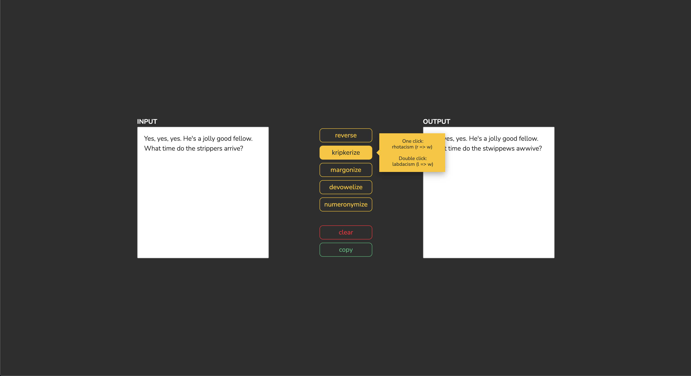

# txtmnpltr

Try out the text manipulator [HERE](https://vildmedpap.github.io/txtmnpltr/).

## Description

Making small text manipulations.

## Learning objectives

Purely frontend objectives:

-   **HTML**: _pug as a preprocessor_
-   **CSS**: _positioning with flex box_, _styling input_, _styling buttons_
-   **JavaScript**:
